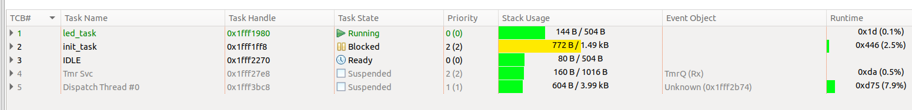
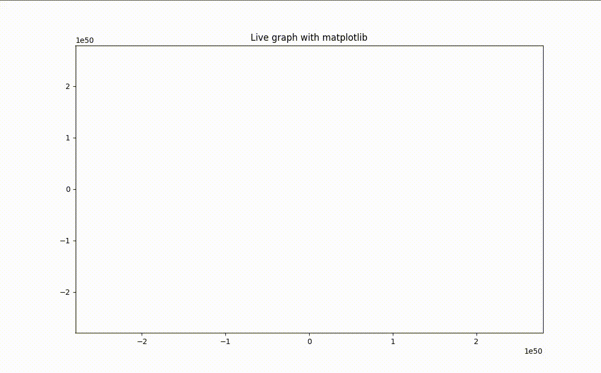
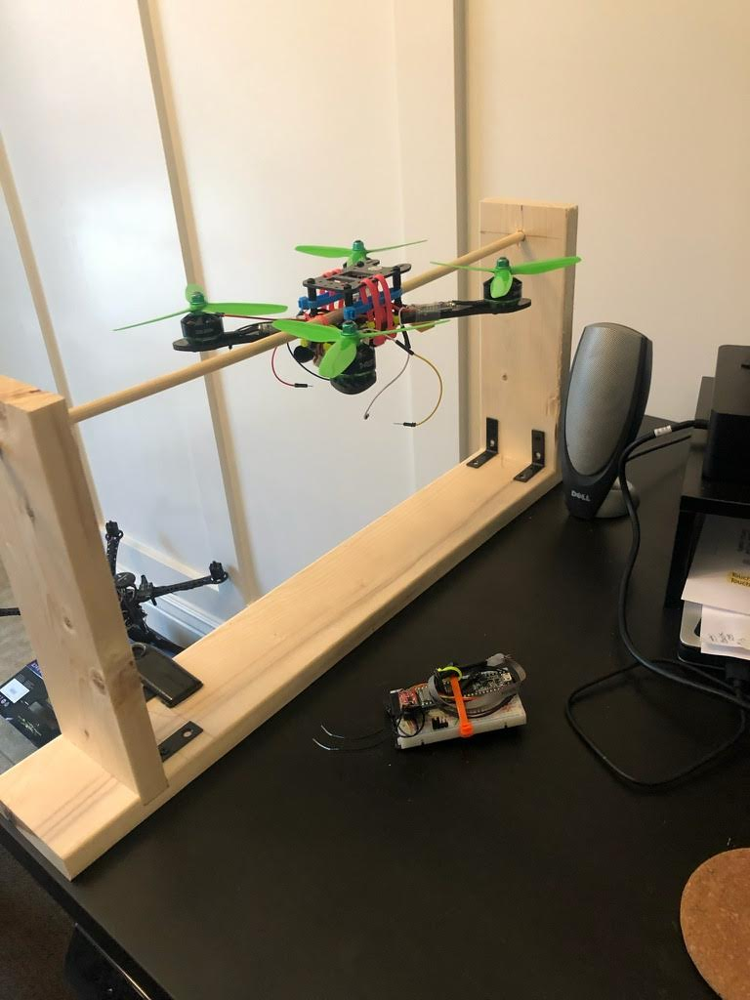

<!--  -->

## What's the point?
Aiming to improve in embedded firmware, electrical engineering, and software design.

## Features
- Makefile + SWD GDB upload and debug
- FreeRTOS
- BSP is essentially `cores/teensy3`
- Dispatch queue for asynchronous and interval scheduling (100us tick interrupt)
- Publish / subscribe communication framework
- MPU9250 @ 1kHz gyro / accel / mag on 10MHz SPI
- FrSky XM+ mini on UART SBUS
- 400Hz PWM outputs for actuator control signals
- 250Hz attitude estimation, 1kHz control. Complimentary filter attitude estimator using euler angles, [WIP] quaternion estimator w/ EKF
- Data streaming in csv format over serial
- Interactive plotting and visualizations with python and OpenGL

Things I'd like to do...

- Telemetry radio to host
- MAVLink over telemetry radio for QGC communication
- Full quaternion estimation and control
- Optical flow for position hold

## Tools
- make / CMake
- GDB
- MCUXpresso
- JLink mini
- Siglent SDS1202X-E

## Components
- Teensy 3.6 microcontroller board
- MPU9250 3-axis gyro / accel / mag
- FrSky Mini radio transmitter
- Blade Theory XL kit from amazon. Removed camera, radios, and flight controller board (leave the power distribution board attached).
- Lipow battery charger
- TaranisQ X7 remote controller

------

## Building with make
I started with a framework I had been hearing about called `platformio`. I figured it sounded cool and I'd try it out. It became severely limiting as soon as I wanted to do anything more than what was supported from it natively, so I switched to a makefile. Using a hodgepodge of references from the interwebs, I created a makefile based build system that can be easily invoked via the command line or from an IDE.

------

## SWD Debugging: JLink + GDB
Now this is a hardware hack. I soldered the reset line on the companion microcontroller (KL02) to ground, this holds the KL02 in reset and thus prevents its activity on the SWD lines.<newline/>
https://mcuoneclipse.com/2017/04/29/modifying-the-teensy-3-5-and-3-6-for-arm-swd-debugging/

### Thread aware debug with MCUXpresso
I nice tool built into MCUXpresso, only requiring a somewhat poorly explained process for configuring it. I was able to piece it together from scouring the internet, and it is really useful! You can view your stack sizes, heap usage, and % cpu at any breakpoint.

### Segger SystemView
An amazing tool if you really want to take a detailed look "inside" of your machine. You can instrument any section of code you'd like using the API, however I chose to only verify ISR / Task interaction and timing characteristics.
 
https://www.segger.com/products/development-tools/systemview/

------
### Attitude visualization
I created a tool using OpenGL to visualize attitude data coming from the flight controller in real time.

------
### Data visualization
I created a tool in C++ that reads 3-axis data from the serial port and optionally writes it to a file. I then run an ellipsoid fit algorithm on the data set and plot the data in 3D with the caclulated offsets and scales for each axis.
https://plot.ly/python/3d-scatter-plots/

------
### Live plotting
I use the 3-axis data stream and plot the results in real time. I can choose the data stream I am interested in with a simple shell command via the USB port. 
_i.e_ `stream rpy data`

------
### Rate loop tuning
I started by tuning the pitch controller first, and then duplicated those settings for the roll controller. My flight controller is mostly symmetric so this worked well. I configured a data stream to send the setpoints and the measured pitch/roll/pitchrate/rollrate so that I could see the effects of changes to the controller gains.

#### Step response
Shallow angle step toggling. Rate angle is fixed(80dps) and rate setpoint toggles when orientation reaches either of two shallow angles(12deg).

### First flight
https://www.youtube.com/watch?v=_Rxv4iX8fl8

 

***Thank you to...***

The PX4 team, you guys rock https://github.com/PX4/Firmware 
Phillip Johnston https://embeddedartistry.com/ 
Erich Styger https://mcuoneclipse.com/ 
Paul Stoffregen https://www.pjrc.com/store/teensy36.html 
 

_"If I have seen further it is by standing on the shoulders of Giants."_ -- Isaac Newton

