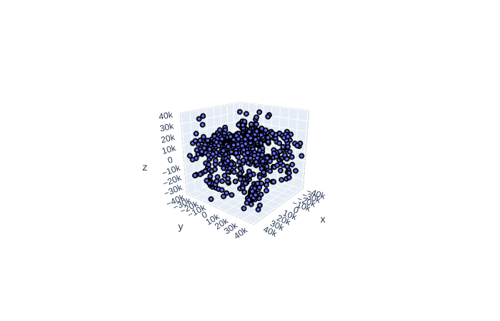

## What's the point?
Challenging my ability to learn, improve, and produce practical high quality embedded systems and software.

## Features
- Makefile + SWD GDB upload and debug
- FreeRTOS
- BSP is essentially `cores/teensy3`
- C++ Dispatch queue for asynchronous and interval scheduling (100us tick interrupt)
- Publish / Subscribe communication framework (very light weight)
- MPU9250 @ 1kHz gyro / accel / mag on 10MHz SPI
- FrSky XM+ mini on UART SBUS
- PWM driver at 400Hz for actuator control signals
- Calibration -- offsets/scales + ellipsoid fit for mag
- Data visualization with python -- serial UART to host PC

## Debugging -- SWD: JLink + GDB + MCUXpresso
Now this is a hardware hack. I soldered the reset line on the companion microcontroller (KL02) to ground, this holds the KL02 in reset and thus prevents its activity on the SWD lines. 
https://mcuoneclipse.com/2017/04/29/modifying-the-teensy-3-5-and-3-6-for-arm-swd-debugging/
### Thread aware debug with MCUXpresso
Pretty neat little GUI in MCUXpresso. I ended up implementing the debug support when I got stuck for a few hours on a program crash. It ended up being a stack overflow that I didn't suspect because I didn't know that the FreeRTOS `overflow_hook()` is not reliable.

Anyways, check out your stack and heap usage as well as runtime stats

### Segger SystemView
This piece of software is amazing. I learn so much from reviewing the information preseneted in this GUI. Your program can be instrumented as much or as little as you'd like! This is used to verify timing as well as scheduling characteristics. This was a little bit of effort to integrate into the build but definitely worth it. As checked-in (9/1/19) it is ready to go with the click of a button! With the JLink hooked up: Target --> Start Recording.
 
https://www.segger.com/products/development-tools/systemview/

### Interactive data visualization
Created a tool in C++ that reads and parses mag data via a serial port, runs an ellipsoid fit algorithm on the data set, and then plots the data in 3D with the caclulated offsets and scales for each axis. The plot is a 3D interactive plot created with `plotly`. 
https://plot.ly/python/3d-scatter-plots/

***Thank you to...***

The PX4 team, you guys rock https://github.com/PX4/Firmware 
Phillip Johnston https://embeddedartistry.com/ 
Erich Styger https://mcuoneclipse.com/ 
Paul Stoffregen https://www.pjrc.com/store/teensy36.html 

