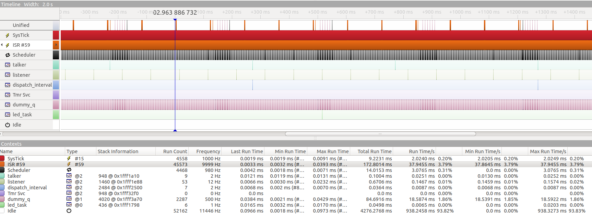

## What's the point?
Challenging my ability to learn, improve, and produce practical high quality embedded systems and software.

## Features
- FreeRTOS
- BSP is essentially cores/teensy3
- C++ Dispatch queue for asynchronous and interval scheduling
- Publish / Subscribe communication framework (very light weight)
- Timers
- SPI bus
- UART SBUS
- MPU9250 @ 500Hz gyro / accel
- FrSky XM+ mini

## Debugging -- SWD: JLink + GDB + MCUXpresso
Now this is a hardware hack. I soldered the reset line on the companion microcontroller (KL08) to ground, this holds the KL08 in reset and thus prevents its activity on the SWD lines. This project is a no-go without the ability to debug, so setting this up was one of the first problems tackled.
https://mcuoneclipse.com/2017/04/29/modifying-the-teensy-3-5-and-3-6-for-arm-swd-debugging/
### Thread aware debug with MCUXpresso
Pretty neat little GUI in MCUXpresso. I ended up implementing the debug support when  I got stuck for a few hours on a program crash. It ended up being a stack overflow that I didn't suspect because I didn't know that the `stack_overflow_hook()` is not reliable!! :(

Anyways, check out your stack usage 

### Segger SystemView
This piece of software is amazing. I learn so much from reviewing the information preseneted in this GUI. Your program can be instrumented as much or as little as you'd like! This is used to verify timing as well as scheduling characteristics. This was a little bit of effort to integrate into the build but definitely worth it. As checked-in (9/1/19) it is ready to go with the click of a button! With the JLink hooked up: Target --> Start Recording.

